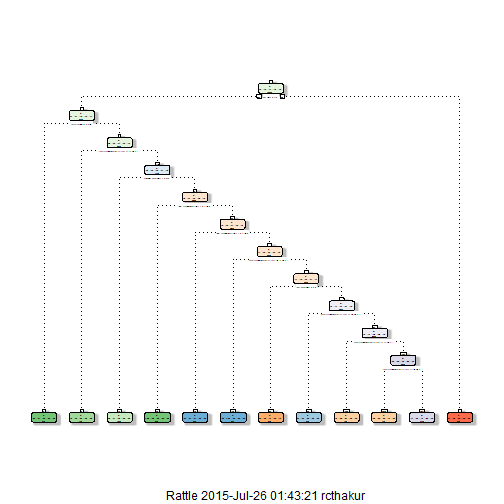

## Introduction

For this project we did the prediction analysis of a weight lifting exercise data set. The data set contains the measurments of a accelerometer on the belt, forearm, arm, and dumbell of 6 participants. They were asked to perform barbell lifts correctly and incorrectly in 5 different ways. The data set for this project com from <http://groupware.les.inf.puc-rio.br/har>  The goal of this project is to predict the manner in which the participants did the exercise.

## Data Download and Reading


```r
## Data download
trainUrl <-"http://d396qusza40orc.cloudfront.net/predmachlearn/pml-training.csv"
testUrl <- "http://d396qusza40orc.cloudfront.net/predmachlearn/pml-testing.csv"
 download.file(trainUrl, destfile="./training.csv")
 download.file(testUrl, destfile="./testing.csv")
```


```r
## Data reading
training <- read.csv("training.csv")
testing <- read.csv("testing.csv")
dim(training)
```

```
## [1] 19622   160
```

```r
dim(testing)
```

```
## [1]  20 160
```

## Data Preprocessing and Cleaning

In this step I removed some varibles that do not contribute much to the prediction model. First I identified and removed the varibles from the training data and then removed the same variables from the test data.


```r
library(caret)
library(rpart)
library(rpart.plot)
library(randomForest)
library(RColorBrewer)
library(rattle)
```

 First I removed the variables with nearly zero variance.
 

```r
### remove variables with nearly zero variance
NZVdata <- nearZeroVar(training, saveMetrics=TRUE)
nzv<-which(NZVdata$nzv==TRUE)
training<-training[,-nzv]
```
Then I removed the variables with more than 60% NA values.


```r
### remove variables with more than 60% NA values
naPob<-colSums(is.na(training))/nrow(training)
colrm<-which(naPob>=0.6)
training<-training[,-colrm]
```
And finally removed some useless variables that do not contribute to the prediction of varaible 'classe'.


```r
## remove variables which may not be important for prediction
training<-training[,-(1:2)]
```
Also cleaned the test data.


```r
###cleaning the test data
cleanCol <- colnames(training[, -57])
testing <- testing[cleanCol]
#To check the new number of observations
dim(training)
```

```
## [1] 19622    57
```

```r
dim(testing)
```

```
## [1] 20 56
```

## Data Slicing

 I sliced the cleaned training data further into smaller training and testing data sets to train and validate the model and estimate the out of sample error.


```r
set.seed(543)
## slice the cleaned training data into smaller training and test data
inTrain <- createDataPartition(y=training$classe, p=0.6, list=FALSE)
myTraining <- training[inTrain, ]
myTesting <- training[-inTrain, ]
dim(myTraining)
```

```
## [1] 11776    57
```

```r
dim(myTesting)
```

```
## [1] 7846   57
```

## Model Building and Selection

I built two prediction models using two different ML algorithms and then selected the one with smallest out of sample error to do prediction. I used 5 fold cross-validation to estimates the errors.

### Model training with Decision Tree


```r
## train using 5 fold CV
fitControl <- trainControl(method="cv", number=5, verboseIter=F)
modFit1 <- train(classe ~ .,method="rpart",data=myTraining, trControl=fitControl)
modFit1
```

```
## CART 
## 
## 11776 samples
##    56 predictor
##     5 classes: 'A', 'B', 'C', 'D', 'E' 
## 
## No pre-processing
## Resampling: Cross-Validated (5 fold) 
## Summary of sample sizes: 9420, 9421, 9422, 9421, 9420 
## Resampling results across tuning parameters:
## 
##   cp          Accuracy   Kappa       Accuracy SD  Kappa SD  
##   0.03369720  0.6411318  0.54854943  0.03221950   0.04078059
##   0.03595159  0.5073944  0.35001082  0.12870389   0.20284003
##   0.11580446  0.3149646  0.04678001  0.04222768   0.06417705
## 
## Accuracy was used to select the optimal model using  the largest value.
## The final value used for the model was cp = 0.0336972.
```


```r
# In sample error = 35.9%
```


```r
fancyRpartPlot(modFit1$finalModel)
```

 

### Model Training With Random Forests


```r
#modFit2 <- train(classe~ .,data=myTraining, method="rf",trControl=fitControl) ## it was taking long time to run
modFit2<-randomForest(classe ~ ., data=myTraining, trControl=fitControl)
modFit2
```

```
## 
## Call:
##  randomForest(formula = classe ~ ., data = myTraining, trControl = fitControl) 
##                Type of random forest: classification
##                      Number of trees: 500
## No. of variables tried at each split: 7
## 
##         OOB estimate of  error rate: 0.21%
## Confusion matrix:
##      A    B    C    D    E  class.error
## A 3347    1    0    0    0 0.0002986858
## B    4 2274    1    0    0 0.0021939447
## C    0    4 2049    1    0 0.0024342746
## D    0    0    6 1921    3 0.0046632124
## E    0    0    0    5 2160 0.0023094688
```


```r
# In sample error = 0.21%
```

 I expect Random Forests to perform better as it has a very small in sample error/ estimate of out of sample error.
 
Now I find the out of sample errors for the  two models.

### Prediction with Decision Tree


```r
predict1 <- predict(modFit1, myTesting)
confusionMatrix(predict1, myTesting$classe)
```

```
## Confusion Matrix and Statistics
## 
##           Reference
## Prediction    A    B    C    D    E
##          A 1675  387   42   63   16
##          B  158  641    9    0    0
##          C  114  421 1040  122   83
##          D  280   69  277 1101  697
##          E    5    0    0    0  646
## 
## Overall Statistics
##                                          
##                Accuracy : 0.6504         
##                  95% CI : (0.6397, 0.661)
##     No Information Rate : 0.2845         
##     P-Value [Acc > NIR] : < 2.2e-16      
##                                          
##                   Kappa : 0.5605         
##  Mcnemar's Test P-Value : NA             
## 
## Statistics by Class:
## 
##                      Class: A Class: B Class: C Class: D Class: E
## Sensitivity            0.7504   0.4223   0.7602   0.8561  0.44799
## Specificity            0.9095   0.9736   0.8858   0.7983  0.99922
## Pos Pred Value         0.7673   0.7933   0.5843   0.4542  0.99232
## Neg Pred Value         0.9016   0.8754   0.9459   0.9659  0.88937
## Prevalence             0.2845   0.1935   0.1744   0.1639  0.18379
## Detection Rate         0.2135   0.0817   0.1326   0.1403  0.08233
## Detection Prevalence   0.2782   0.1030   0.2269   0.3089  0.08297
## Balanced Accuracy      0.8300   0.6979   0.8230   0.8272  0.72360
```


```r
# Out of sample error is about 35 %
```

### Prediction with Random Forests


```r
predict2 <- predict(modFit2, myTesting)
confusionMatrix(predict2, myTesting$classe)
```

```
## Confusion Matrix and Statistics
## 
##           Reference
## Prediction    A    B    C    D    E
##          A 2232    2    0    0    0
##          B    0 1516    1    0    0
##          C    0    0 1365    2    0
##          D    0    0    2 1284    1
##          E    0    0    0    0 1441
## 
## Overall Statistics
##                                          
##                Accuracy : 0.999          
##                  95% CI : (0.998, 0.9996)
##     No Information Rate : 0.2845         
##     P-Value [Acc > NIR] : < 2.2e-16      
##                                          
##                   Kappa : 0.9987         
##  Mcnemar's Test P-Value : NA             
## 
## Statistics by Class:
## 
##                      Class: A Class: B Class: C Class: D Class: E
## Sensitivity            1.0000   0.9987   0.9978   0.9984   0.9993
## Specificity            0.9996   0.9998   0.9997   0.9995   1.0000
## Pos Pred Value         0.9991   0.9993   0.9985   0.9977   1.0000
## Neg Pred Value         1.0000   0.9997   0.9995   0.9997   0.9998
## Prevalence             0.2845   0.1935   0.1744   0.1639   0.1838
## Detection Rate         0.2845   0.1932   0.1740   0.1637   0.1837
## Detection Prevalence   0.2847   0.1933   0.1742   0.1640   0.1837
## Balanced Accuracy      0.9998   0.9993   0.9987   0.9990   0.9997
```


```r
# Out of sample error = 0.1 % 
```

AS expected, Random Forests performed way better than the other ML algorithm with minimum out of sample error(0.1%). So I fitted prediction model using Random Forests algorithm to predict the 'classe' variable .


## Prediction using Test Data Set

Before prediction, I made the testing data of the same type as training data because I was getting error that the two data sets are of not same type while running random forest.


```r
## make the two sets of same type
testing<-rbind(myTraining[2,-57],testing)
testing<-testing[-1,]
```


```r
# predict with test set
pred <- predict(modFit2, newdata=testing)
pred
```

```
##  2  3 41  5  6  7  8  9 10 11 12 13 14 15 16 17 18 19 20 21 
##  B  A  B  A  A  E  D  B  A  A  B  C  B  A  E  E  A  B  B  B 
## Levels: A B C D E
```
## Generating Files to submit for assignment


```r
# convert predictions to character vector
pred <- as.character(pred)

# function to write predictions to files
pml_write_files <- function(x) {
        n <- length(x)
        for(i in 1:n) {
                filename <- paste0("problem_id_", i, ".txt")
                write.table(x[i], file=filename, quote=F, row.names=F, col.names=F)
        }
}

# create prediction files to submit
pml_write_files(pred)
```

